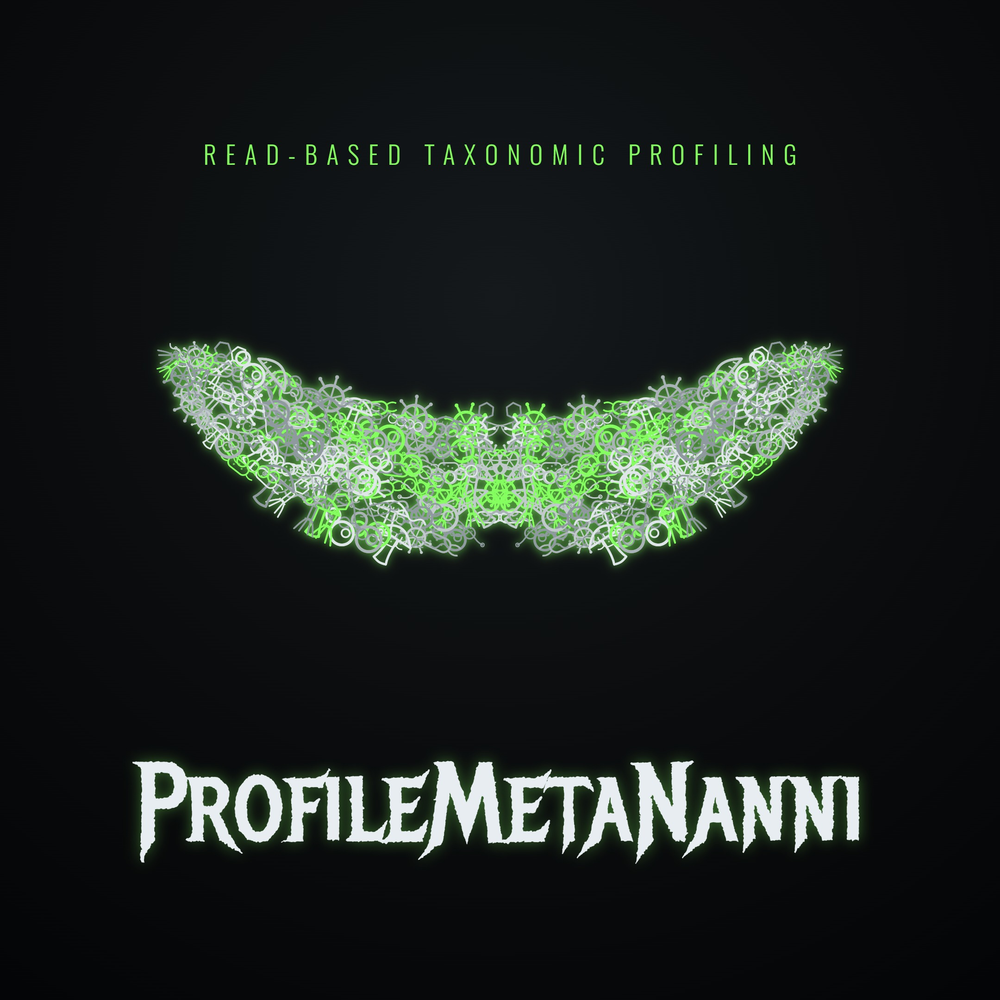

# profilemetananni

<p align="center">
  
</p>

<p align="center"><em>ProfileMetaNanni — read-based metagenomic <strong>Profil</strong>ing assistant.</em></p>

A **model-agnostic, guided metagenomics assistant** for read-based taxonomic profiling of
microbial communities. **Any** language model — a local open-source model on **Ollama**, or a
hosted model such as **Claude** — can drive it by following `SPEC.md`. The intelligence lives
in tested, anti-bug scripts; the model only **interviews you, runs the scripts, and helps
interpret the results**.

> 🇮🇹 Un **assistente di metagenomica guidato e indipendente dal modello IA**, per il profiling
> tassonomico read-based di comunità microbiche. **Qualunque** modello — uno locale open-source
> su **Ollama** o un modello come **Claude** — lo può pilotare seguendo `SPEC.md`. L'intelligenza
> sta negli script (testati e anti-bug); il modello fa solo da guida: **ti intervista, lancia gli
> script e ti aiuta a interpretare i risultati.**

---

## 📑 Contents · Indice

- [🇬🇧 English](#-english)
  - [1. What is it?](#1-what-is-profilemetananni) · [2. What it does](#2-what-it-does-the-pipeline) · [3. Who is it for?](#3-who-is-it-for) · [4. How it works](#4-how-it-works-architecture)
  - [5. Before you start](#5-what-you-need-before-you-start) · [6. Get it from GitHub](#6-get-it-from-github) · [7. Quick start from zero](#7-quick-start-from-zero-absolute-beginner) · [8. Quick start (expert)](#8-quick-start-expert)
  - [9. The interview](#9-the-interview-what-the-assistant-asks) · [10. config.yaml reference](#10-configyaml-reference) · [11. Databases](#11-databases) · [12. NCBI API key](#12-ncbi-api-key-optional-secure)
  - [13. PBS cluster](#13-running-on-a-pbs-cluster) · [14. Outputs](#14-what-you-get-outputs) · [15. Reading results](#15-reading-the-results) · [16. Troubleshooting](#16-troubleshooting) · [17. Scope](#17-scope--what-it-does-not-do) · [18. Security](#18-security) · [19. Glossary](#19-glossary-for-biologists) · [20. Citations](#20-citations)
- [🇮🇹 Italiano](#-italiano)
- [🛠️ Publishing to GitHub · Pubblicare su GitHub](#️-publishing-to-github--pubblicare-su-github)
- [📁 Repository layout · Struttura](#-repository-layout--struttura-del-repository)
- [📄 License · Licenza](#-license--licenza)

---

# 🇬🇧 English

## 1. What is profilemetananni?

`profilemetananni` is a **ready-to-run pipeline** that takes raw shotgun metagenomic sequencing
reads and tells you **which microorganisms are in your samples and in what proportions**.

The twist: it is **driven by an AI assistant** instead of by you typing commands. You talk to
the AI in plain language; the AI asks you a few questions, then runs the (already-written,
already-tested) scripts for you and explains the output.

Three ideas make it special:

- **🤖 Model-agnostic** — it is not tied to one AI. The "brain" is a plain-text protocol file
  (`SPEC.md`) that *any* capable model can read and follow: a free local model via Ollama, or
  Claude, etc. The actual analysis is done by deterministic shell/Python/R scripts, so results
  do not depend on which AI you used.
- **🧪 Anti-bug & reproducible** — every step validates its inputs, is idempotent (re-running
  skips work already done), and refuses to delete your raw data.
- **🔒 Safe** — it is built to resist *prompt injection* (a malicious dataset trying to trick
  the AI into running harmful commands). See [Security](#18-security).

## 2. What it does (the pipeline)

```
        ┌─────────────── STEP 0: environment setup (conda) ───────────────┐
        │  auto-detect conda/mamba → install only the missing pmn_* envs   │
        └──────────────────────────────────────────────────────────────────┘
PHASE A — preprocessing                       PHASE B — read-based profiling
  size estimate (ENA) ── GATE                   MetaPhlAn 4  ┐
  download SRA (optional)                        and / or    ├─ profiling
  trimming (fastp) + FastQC                      Kraken2 + Bracken ┘
  host filtering (Bowtie2, incl. human)         → species × sample matrices
  MultiQC report                                → MetaPhlAn-vs-Kraken comparison (Excel)
                                                → diversity: CLR / Aitchison / PCA + alpha
                                                → overview Excel reports
```

- **Step 0 — Environment setup.** Detects `conda`/`mamba` and creates only the missing
  `pmn_*` conda environments (it never touches your existing environments).
- **Phase A — Preprocessing.**
  1. **Size check (gate)** — estimates the download size from ENA and compares it to free disk
     **before** downloading, so you never run out of space mid-download.
  2. **Download** SRA runs (only if your data source is `ncbi`).
  3. **Trimming** with `fastp`; **FastQC** is run on raw and trimmed reads for the QC report.
  4. **Host filtering** with `Bowtie2` — removes host/substrate reads (e.g. pig, cow) and
     **human** reads (privacy + quality).
  5. **MultiQC** — one consolidated quality report.
- **Phase B — Read-based profiling.**
  1. **MetaPhlAn 4** (marker-gene) and/or **Kraken2 + Bracken** (k-mer) — you choose.
  2. **Matrices** — species × sample tables for each tool.
  3. **Comparison** (only when you run *both* tools) — an Excel workbook of shared / tool-specific
     taxa and overlap metrics.
  4. **Diversity** — compositional **CLR + Aitchison distance + PCA** (beta) and **alpha**
     diversity (richness, Shannon, Simpson).
  5. **Overview Excel reports.**

**Out of scope (on purpose):** strain-level analysis (StrainPhlAn), genome assembly, MAG
recovery, functional annotation. See [Scope](#17-scope--what-it-does-not-do).

## 3. Who is it for?

- **🌱 Biologists who barely use a computer** — follow [Quick start from zero](#7-quick-start-from-zero-absolute-beginner).
  You will mostly talk to the AI in plain language; copy-paste a handful of commands.
- **🧑‍💻 Expert bioinformaticians** — see [Quick start (expert)](#8-quick-start-expert) and the
  [config.yaml reference](#10-configyaml-reference). You can skip the AI entirely and run the
  scripts directly.

## 4. How it works (architecture)

```
   You ──talk──▶  AI model (Ollama / Claude)  ──reads──▶  SPEC.md  (the protocol)
                          │                                  │
                          │ runs (validated args)            │ interview + safety rules
                          ▼                                  ▼
                  bin/run.sh  ──orchestrates──▶  steps/*.sh, *.py, *.R   (the real work)
                          │
                          ▼
                  local machine  OR  PBS cluster   (auto-detected)
```

- **`SPEC.md`** is the contract the AI follows: the interview questions, the execution order,
  the literature-backed guidance, and a non-negotiable **Safety Constitution**.
- **`bin/run.sh`** reads your answers from `config.yaml`, validates every value, and runs each
  step in the right order, either locally or by submitting PBS jobs (it detects which).
- **`steps/`** holds one small script per pipeline step. Each is independent, validated and
  idempotent.

Because the analysis is in the scripts (not in the AI's head), **the AI is interchangeable** and
**the results are reproducible**.

## 5. What you need before you start

- A **Linux** server or a **PBS Pro** cluster (auto-detected). macOS works for local runs.
  On Windows, use WSL2 or Git Bash with a real Linux toolchain.
- A POSIX shell with **bash ≥ 4**.
- **conda** or **mamba** — install Miniforge if you have neither:
  <https://github.com/conda-forge/miniforge>
- **Internet access on the machine that runs the steps** (compute nodes on a cluster usually
  have it; login nodes sometimes do not).
- **An AI model** to drive it (optional but recommended):
  - **Claude** (e.g. Claude Code), **or**
  - a local model via **Ollama** (<https://ollama.com>), e.g. `ollama pull llama3.1` or a
    capable instruct model. The model must be able to read `SPEC.md` and call shell commands.
- **Disk space** — profiling databases are large (see [Databases](#11-databases)).

## 6. Get it from GitHub

```bash
# Option A — clone the repository (recommended):
git clone https://github.com/GiampieroFederici/profilemetananni.git
cd profilemetananni

# Option B — download a release .zip from the GitHub "Releases" page, then:
unzip profilemetananni-*.zip && cd profilemetananni-*
```

This points to **GiampieroFederici**'s published copy. If you are publishing your own copy, use your
GitHub account instead — see [Publishing to GitHub](#️-publishing-to-github--pubblicare-su-github).

## 7. Quick start from zero (absolute beginner)

> You will run ~5 commands and answer some questions. Take it one line at a time.

**① Open a terminal on your server.** (On a cluster, log in via SSH as instructed by your admin.)

**② Make sure conda exists.** Type `conda --version`. If you see "command not found", install
Miniforge:
```bash
wget https://github.com/conda-forge/miniforge/releases/latest/download/Miniforge3-Linux-x86_64.sh
bash Miniforge3-Linux-x86_64.sh          # accept the defaults, then close & reopen the terminal
```

**③ Get the tool** (see [section 6](#6-get-it-from-github)):
```bash
git clone https://github.com/GiampieroFederici/profilemetananni.git
cd profilemetananni
```

**④ Let the tool set up its software** (creates the conda environments it needs):
```bash
bash bin/preflight.sh --lang en --install
```

**⑤ Choose your path:**

- **With an AI (recommended):** open your AI assistant in this folder, and say:
  > "Read `SPEC.md` and `README.md`, then guide me through running profilemetananni on my data."

  The AI will ask you the [interview questions](#9-the-interview-what-the-assistant-asks),
  write `config.yaml` for you, run each step, and explain the output. **The very first thing it
  asks is your language (English or Italian).**

- **Without an AI (manual):**
  ```bash
  cp config.example.yaml config.yaml
  nano config.yaml          # fill in: data source, hosts, profiler, paths (see section 10)
  bash bin/run.sh --config config.yaml --dry-run    # preview the plan
  bash bin/run.sh --config config.yaml              # run for real
  ```

**⑥ Find your results** in `<work_dir>/results/` and the quality report in
`<work_dir>/multiqc/`. See [Outputs](#14-what-you-get-outputs).

## 8. Quick start (expert)

```bash
bash bin/preflight.sh --install                 # create missing pmn_* envs (idempotent)
cp config.example.yaml config.yaml && $EDITOR config.yaml
bash bin/run.sh --config config.yaml --dry-run  # print the full plan (no side effects)
bash bin/run.sh --config config.yaml            # execute (local or PBS, auto-detected)
```

- `--dry-run` prints every planned step without executing — safe to run anytime.
- `--skip-preflight` skips the environment check.
- Re-running is safe: each step skips outputs that already exist.
- On PBS, set `execution.scheduler: pbs` (or leave `auto`) and the `execution.pbs_*` keys.

## 9. The interview (what the assistant asks)

In order (defined in `SPEC.md`):

1. **Language** — English or Italian (asked first; used for everything after).
2. **Data source** — `ncbi` (download by SRA accession), `local` (your FASTQ files), or `both`.
   - For `ncbi`: a file with one SRA accession per line. *(Optional secure NCBI API key — see
     [section 12](#12-ncbi-api-key-optional-secure).)*
   - For `local`: the folder with your FASTQ reads.
3. **Host(s) to remove** — human is removed automatically; you pick any extra host/substrate
   genomes (e.g. `sus_scrofa`) from `refs/hosts.tsv`.
4. **Profiler** — `metaphlan`, `kraken`, or `both` (the assistant explains the trade-offs with
   citations).
5. **Thresholds** — abundance/confidence thresholds (defaults explained; the diversity *method*
   is fixed by design). *Optional:* provide a metadata TSV (a `sample` column + a group column) to
   **colour the PCA** and compare alpha diversity across groups — you supply it once at setup, then
   everything is automatic.
6. **Databases** — use an existing DB (give the path) or auto-install on confirmation; for
   Kraken, choose `standard` or a `custom` DB built from your own genome list.
7. **Cleanup** — keep or delete trimmed reads; save or discard host-mapped reads.
8. **Folder layout** — `managed` (the tool owns clean folders) or `custom` (you provide them).
9. **Execution** — scheduler (auto/pbs/local), threads, and — on PBS — queue, walltime, memory.

## 10. config.yaml reference

Copy `config.example.yaml` → `config.yaml` and edit. Every value is validated before use.

| Key | Meaning | Default |
|---|---|---|
| `language` | `en` or `it` | `en` |
| `data_source` | `ncbi` / `local` / `both` | `ncbi` |
| `project_name` | label used in folder names (A–Z a–z 0–9 . _ -) | `my_study` |
| `hosts` | extra host genomes to remove (from `refs/hosts.tsv`) | `[sus_scrofa]` |
| `filter_human` | remove human reads automatically | `true` |
| `cleanup.keep_trimmed` | keep trimmed reads after host filtering | `false` |
| `cleanup.keep_host_reads` | save host-mapped reads to a folder | `false` |
| `cleanup.host_reads_dir` | where to save them (empty → `<work_dir>/host_reads`) | `""` |
| `paths.layout` | `managed` or `custom` | `managed` |
| `paths.work_dir` | base output directory | `./pmn_work` |
| `paths.local_reads_dir` | FASTQ folder (for `local`/`both`) | `""` |
| `paths.srr_list` | file of SRA accessions (for `ncbi`/`both`) | `""` |
| `paths.{raw,trim,nonhost,results,logs}_dir` | custom layout only | `""` |
| `profiling.tool` | `metaphlan` / `kraken` / `both` | `both` |
| `profiling.metaphlan_db` | MetaPhlAn DB dir (empty + auto = install) | `""` |
| `profiling.kraken_db` | Kraken2 DB dir (empty + auto = build) | `""` |
| `profiling.auto_install_db` | auto-download/build missing DBs (LARGE) | `false` |
| `profiling.kraken_db_mode` | `standard` or `custom` | `standard` |
| `profiling.kraken_custom_genomes` | NCBI accession list for a custom DB | `""` |
| `profiling.kraken_confidence` | Kraken2 `--confidence` (0–1) | `0.4` |
| `profiling.bracken_readlen` | Bracken read length (must match the DB) | `150` |
| `profiling.abundance_threshold_pct` | abundance threshold (%) for reports | `0.001` |
| `analysis.report` | write the overview Excel report | `true` |
| `analysis.diversity` | compute alpha/beta diversity | `true` |
| `analysis.metadata` | optional TSV (`sample` + group column) → coloured PCA + group tests | `""` |
| `analysis.group_col` | metadata column to group by (e.g. `product`); needs `metadata` | `""` |
| `execution.scheduler` | `auto` / `pbs` / `local` | `auto` |
| `execution.threads` | CPU threads per step | `8` |
| `execution.pbs_queue` | **required on PBS** (e.g. `commonCPUQ`) | `""` |
| `execution.pbs_walltime` | PBS walltime per job (`HH:MM:SS`) | `24:00:00` |
| `execution.pbs_mem` | PBS memory per job (e.g. `32GB`) | `32GB` |
| `execution.pbs_select` | optional raw `select=...` override | `""` |

> ⚠️ Do **not** put your NCBI API key in this file (see [section 12](#12-ncbi-api-key-optional-secure)).

## 11. Databases

Profiling needs reference databases. They are **large** — install them once.

- **MetaPhlAn (ChocoPhlAn)** — ~25 GB. If `profiling.metaphlan_db` is empty and
  `auto_install_db: true`, the tool installs it (`steps/13_metaphlan_db.sh`).
- **Kraken2** — ~50–90 GB for the standard DB.
  - `kraken_db_mode: standard` → RefSeq standard DB (`steps/12_kraken_db.sh --mode standard`).
  - `kraken_db_mode: custom` → built from your own NCBI assembly accessions listed in
    `profiling.kraken_custom_genomes` (one `GCF_…`/`GCA_…` per line).
  - In both cases a **Bracken** k-mer distribution is built for your `bracken_readlen`.

> ⚠️ **Memory:** Kraken2 loads the database into RAM, so `pbs_mem` MUST exceed the DB size
> (≥ ~80 GB for the standard DB). MetaPhlAn-only or a small custom Kraken DB needs much less.

`auto_install_db: true` is treated as your **explicit confirmation** for the large download —
the AI will also confirm before starting. If you already have DBs, just set the paths.

## 12. NCBI API key (optional, secure)

An NCBI API key is **not required**. It only raises NCBI download rate limits — handy when
fetching many genomes for a custom Kraken DB.

If you have one:

1. Get it: NCBI account → **Account Settings** → **API Key Management**.
2. Export it in your shell **before** running the tool:
   ```bash
   export NCBI_API_KEY=<your_key>
   ```
3. That's it. The tool reads it **only from the environment**, never from `config.yaml`, and
   forwards it to PBS jobs **by name** (`qsub -v NCBI_API_KEY`) so the value is **never written
   to disk or logs**.

> 💡 We deliberately do **not** ship an NCBI "MCP server": that would break the model-agnostic
> design (many local models don't speak MCP) and duplicate the tested NCBI scripts. The secure
> API-key path above is what actually helps.

## 13. Running on a PBS cluster

The scheduler is auto-detected (`qsub` present → PBS). On PBS you **must** set the cluster
parameters up front, or `qsub` will reject the jobs:

```yaml
execution:
  scheduler: auto            # or: pbs
  threads: 10
  pbs_queue: "commonCPUQ"    # YOUR cluster's queue name — ask your admin
  pbs_walltime: "48:00:00"   # estimate generously
  pbs_mem: "80GB"            # Kraken standard DB needs a lot (loaded fully into RAM)
  pbs_select: ""             # advanced: raw 'select=...' override; empty = built from threads+mem
```

> The example values (`commonCPUQ`, etc.) are from one specific cluster (UniTN HPC3). **Yours
> will differ** — ask your cluster administrator. Each step is submitted as a blocking job, so
> the pipeline waits for each to finish before the next.

## 14. What you get (outputs)

Under `<work_dir>/` (with the default `managed` layout):

```
pmn_work/
  size/        download_size_estimate.csv          (pre-download size report)
  raw/         downloaded FASTQ (if data_source = ncbi)
  trim/        trimmed reads (deleted unless keep_trimmed: true)
  nonhost/     host-filtered reads (the input to profiling)
  multiqc/     *_multiqc_report.html               ← open this first
  metaphlan/   per-sample MetaPhlAn profiles
  kraken/      per-sample Kraken2/Bracken outputs
  results/
    metaphlan_merged.tsv          merged MetaPhlAn table
    kraken_matrix.tsv             Kraken/Bracken species × sample matrix
    metaphlan_matrix.tsv          MetaPhlAn species × sample matrix (for diversity)
    report_overview.xlsx          overview: all_taxa (+ MetaPhlAn-vs-Kraken when tool = both)
    diversity_metaphlan/          alpha_diversity.csv, pca_scores.csv, pca_aitchison.png, ...
    diversity_kraken/             same, for Kraken
```

## 15. Reading the results

- **Always open the MultiQC report first** (`multiqc/`): check read counts, quality, and how
  much was removed as host/human.
- **`report_overview.xlsx`** — which species each tool detected, their max abundance, and (with
  both tools) how well they agree.
- **`diversity_*/`** — `pca_aitchison.png` shows sample structure; `alpha_diversity.csv` gives
  richness/Shannon/Simpson per sample. If you supplied metadata, the PCA is **coloured by group**
  and `alpha_kruskal.csv` + `alpha_dunn.csv` hold the across-group comparisons.
- **Interpretation is human-guided.** The AI will summarize and cite literature, but it will
  flag uncertainty and never overclaim a biological conclusion. The numbers are yours to judge.

## 16. Troubleshooting

| Symptom | Likely cause / fix |
|---|---|
| `conda/mamba not found` | Install Miniforge (section 5); reopen the terminal. |
| `bash >= 4 is required` | Your `bash` is too old (common on macOS). Install a newer bash. |
| `failed to parse config` | `config.yaml` has a YAML error, or env `pmn_reports_py` is missing → run preflight. |
| `scheduler=pbs requires execution.pbs_queue` | Set your cluster queue (section 13). |
| `Not enough space` (size gate) | Free disk, or point `work_dir` to a bigger filesystem. |
| `… DB not set … and auto_install_db=false` | Set the DB path, or set `auto_install_db: true`. |
| A step "did nothing" | It is idempotent — the output already existed. Delete it to force a redo. |
| CRLF / `\r` errors after editing on Windows | The tool strips CRLF from inputs, but edit scripts with LF endings to be safe. |

## 17. Scope & what it does NOT do

In scope: **Step 0 + Phase A + Phase B** (preprocessing and read-based profiling, up to the
overview Excel reports). **Not** included (by design): StrainPhlAn (strain level), genome
assembly, MAG recovery, functional annotation. If you ask the AI for these, it will say they
are planned but not implemented.

## 18. Security

This tool is designed to resist **prompt injection / jailbreak** — see `SECURITY.md` for the
full threat model. In short:

- Data (filenames, FASTQ, metadata, tool output) is **never** treated as instructions.
- Inputs are checked against strict **allowlists**; there is **no `eval`** and no command is
  built from untrusted strings.
- `config.yaml` is parsed by a **safe loader** and bridged to the shell via `shlex.quote`.
- Destructive/expensive actions need **explicit confirmation**; raw data is never auto-deleted.
- Secrets (e.g. `NCBI_API_KEY`) are read only from the environment, never written to disk/logs.

## 19. Glossary (for biologists)

- **Metagenomics** — sequencing all the DNA in a sample at once (not one isolated organism).
- **Reads** — the short DNA fragments a sequencer produces.
- **Trimming** — cutting low-quality ends/adapters off the reads (here: `fastp`).
- **Host filtering** — removing reads that belong to the host/substrate (e.g. pig) or to humans,
  so only the microbial reads remain (here: `Bowtie2`).
- **Taxonomic profiling** — figuring out which species are present and their proportions.
- **MetaPhlAn** — profiler based on species-specific *marker genes* (high precision).
- **Kraken2 / Bracken** — profiler based on *k-mers* (high recall; Bracken re-estimates abundances).
- **Relative abundance** — the fraction (%) of a community a species represents.
- **Alpha diversity** — diversity *within* one sample (richness, Shannon, Simpson).
- **Beta diversity** — how *different* samples are from each other (here: Aitchison + PCA).
- **CLR (centered log-ratio)** — a transform that handles the *compositional* nature of
  abundance data correctly (Gloor 2017).
- **conda environment** — an isolated software box so tools don't clash.
- **PBS** — a job scheduler on HPC clusters; you submit jobs to a queue.
- **Idempotent** — running it again is safe; it skips work already done.

## 20. Citations

- Beghini et al. 2021, *eLife* — bioBakery 3 / MetaPhlAn. DOI 10.7554/eLife.65088
- Blanco-Míguez et al. 2023, *Nat Biotechnol* — MetaPhlAn 4. DOI 10.1038/s41587-023-01688-w
- Wood et al. 2019, *Genome Biology* — Kraken2. DOI 10.1186/s13059-019-1891-0
- Lu et al. 2017, *PeerJ CS* — Bracken. DOI 10.7717/peerj-cs.104
- Gloor et al. 2017, *Front. Microbiol.* — compositional data / CLR. DOI 10.3389/fmicb.2017.02224
- Edwin et al. 2024, *Environmental Microbiome* — classifier/DB benchmarking. DOI 10.1186/s40793-024-00561-w
- Kruskal & Wallis 1952, *JASA* 47:583-621 — Kruskal-Wallis test (alpha-diversity group comparison).
- Dunn 1964, *Technometrics* 6:241-252 — Dunn post-hoc test (BH-adjusted).

---

# 🇮🇹 Italiano

## 1. Cos'è profilemetananni?

`profilemetananni` è una **pipeline pronta all'uso** che parte dalle reads grezze di
metagenomica shotgun e ti dice **quali microrganismi ci sono nei tuoi campioni e in quali
proporzioni**.

La novità: è **guidata da un'IA** invece che da te che scrivi comandi. Parli con l'IA in
linguaggio naturale; l'IA ti fa qualche domanda, poi lancia per te gli script (già scritti e già
testati) e ti spiega i risultati.

Tre idee la rendono speciale:

- **🤖 Indipendente dal modello** — non è legata a una sola IA. Il "cervello" è un file di testo
  (`SPEC.md`) che *qualunque* modello capace può leggere e seguire: un modello locale gratuito
  via Ollama, oppure Claude, ecc. L'analisi vera la fanno script deterministici (shell/Python/R),
  quindi i risultati non dipendono dall'IA usata.
- **🧪 Anti-bug e riproducibile** — ogni step valida i propri input, è idempotente (rilanciare
  salta ciò che è già fatto) e si rifiuta di cancellare i dati grezzi.
- **🔒 Sicura** — è costruita per resistere al *prompt injection* (un dataset malevolo che prova
  a ingannare l'IA per farle eseguire comandi dannosi). Vedi [Sicurezza](#18-sicurezza).

## 2. Cosa fa (la pipeline)

```
        ┌──────── STEP 0: preparazione ambiente (conda) ────────┐
        │ rileva conda/mamba → installa SOLO gli env pmn_* mancanti │
        └────────────────────────────────────────────────────────┘
FASE A — preprocessing                        FASE B — profiling read-based
  stima dimensione (ENA) ── GATE                MetaPhlAn 4  ┐
  download SRA (opzionale)                       e / oppure  ├─ profiling
  trimming (fastp) + FastQC                      Kraken2 + Bracken ┘
  filtro host (Bowtie2, incl. umano)            → matrici specie × campione
  report MultiQC                                → confronto MetaPhlAn-vs-Kraken (Excel)
                                                → diversità: CLR / Aitchison / PCA + alpha
                                                → report Excel panoramici
```

- **Step 0 — Preparazione ambiente.** Rileva `conda`/`mamba` e crea solo gli ambienti `pmn_*`
  mancanti (non tocca mai i tuoi ambienti esistenti).
- **Fase A — Preprocessing.**
  1. **Controllo dimensione (gate)** — stima i GB da scaricare da ENA e li confronta con lo
     spazio libero **prima** di scaricare, così non resti mai senza spazio a metà.
  2. **Download** delle run SRA (solo se la sorgente dati è `ncbi`).
  3. **Trimming** con `fastp`; **FastQC** su reads grezze e trimmate per il report di qualità.
  4. **Filtro host** con `Bowtie2` — rimuove le reads dell'ospite/substrato (es. maiale, bovino)
     e le reads **umane** (privacy + qualità).
  5. **MultiQC** — un unico report di qualità consolidato.
- **Fase B — Profiling read-based.**
  1. **MetaPhlAn 4** (marker-gene) e/o **Kraken2 + Bracken** (k-mer) — scegli tu.
  2. **Matrici** — tabelle specie × campione per ciascun tool.
  3. **Confronto** (solo se usi *entrambi* i tool) — un Excel con taxa condivisi / specifici di
     un tool e metriche di sovrapposizione.
  4. **Diversità** — composizionale **CLR + distanza di Aitchison + PCA** (beta) e **alpha**
     (richness, Shannon, Simpson).
  5. **Report Excel panoramici.**

**Fuori scope (di proposito):** analisi a livello di ceppo (StrainPhlAn), assembly del genoma,
recupero MAG, annotazione funzionale. Vedi [Scope](#17-scope-cosa-non-fa).

## 3. Per chi è?

- **🌱 Biologi che a malapena usano il computer** — segui [Avvio da zero](#7-avvio-da-zero-principiante-assoluto).
  Per lo più parlerai con l'IA in linguaggio naturale; copi-incolli qualche comando.
- **🧑‍💻 Bioinformatici esperti** — vedi [Avvio rapido (esperto)](#8-avvio-rapido-esperto) e il
  [riferimento config.yaml](#10-riferimento-configyaml). Puoi saltare del tutto l'IA e lanciare
  gli script direttamente.

## 4. Come funziona (architettura)

```
   Tu ──parli──▶  modello IA (Ollama / Claude)  ──legge──▶  SPEC.md  (il protocollo)
                          │                                    │
                          │ lancia (argomenti validati)        │ intervista + regole sicurezza
                          ▼                                    ▼
                  bin/run.sh  ──orchestra──▶  steps/*.sh, *.py, *.R   (il lavoro vero)
                          │
                          ▼
                  macchina locale  OPPURE  cluster PBS   (rilevato in automatico)
```

- **`SPEC.md`** è il contratto che l'IA segue: domande dell'intervista, ordine di esecuzione,
  indicazioni con citazioni della letteratura e una **Costituzione di Sicurezza** non negoziabile.
- **`bin/run.sh`** legge le tue risposte da `config.yaml`, valida ogni valore ed esegue ogni step
  nell'ordine giusto, in locale o inviando job PBS (rileva quale serve).
- **`steps/`** contiene uno script piccolo per ogni step. Ognuno è indipendente, validato e
  idempotente.

Poiché l'analisi è negli script (non nella "testa" dell'IA), **l'IA è intercambiabile** e **i
risultati sono riproducibili**.

## 5. Cosa ti serve prima di iniziare

- Un server **Linux** o un cluster **PBS Pro** (rilevato in automatico). macOS va bene in locale.
  Su Windows usa WSL2 o Git Bash con un vero toolchain Linux.
- Una shell POSIX con **bash ≥ 4**.
- **conda** o **mamba** — installa Miniforge se non hai nessuno dei due:
  <https://github.com/conda-forge/miniforge>
- **Accesso a internet sulla macchina che esegue gli step** (i nodi di calcolo di un cluster di
  solito ce l'hanno; i nodi di login a volte no).
- **Un modello IA** per pilotarla (opzionale ma consigliato):
  - **Claude** (es. Claude Code), **oppure**
  - un modello locale via **Ollama** (<https://ollama.com>), es. `ollama pull llama3.1` o un buon
    modello "instruct". Il modello deve poter leggere `SPEC.md` e lanciare comandi shell.
- **Spazio su disco** — i database di profiling sono grandi (vedi [Database](#11-database)).

## 6. Scaricarlo da GitHub

```bash
# Opzione A — clonare il repository (consigliato):
git clone https://github.com/GiampieroFederici/profilemetananni.git
cd profilemetananni

# Opzione B — scaricare lo .zip dalla pagina "Releases" di GitHub, poi:
unzip profilemetananni-*.zip && cd profilemetananni-*
```

Questo punta alla copia pubblicata di **GiampieroFederici**. Se vuoi pubblicare la tua copia, usa il tuo
account GitHub — vedi [Pubblicare su GitHub](#️-publishing-to-github--pubblicare-su-github).

## 7. Avvio da zero (principiante assoluto)

> Lancerai ~5 comandi e risponderai a qualche domanda. Vai una riga alla volta.

**① Apri un terminale sul tuo server.** (Su un cluster, accedi via SSH come ti ha detto l'admin.)

**② Verifica che conda esista.** Scrivi `conda --version`. Se vedi "command not found", installa
Miniforge:
```bash
wget https://github.com/conda-forge/miniforge/releases/latest/download/Miniforge3-Linux-x86_64.sh
bash Miniforge3-Linux-x86_64.sh          # accetta i default, poi chiudi e riapri il terminale
```

**③ Scarica il tool** (vedi [sezione 6](#6-scaricarlo-da-github)):
```bash
git clone https://github.com/GiampieroFederici/profilemetananni.git
cd profilemetananni
```

**④ Fai preparare il software al tool** (crea gli ambienti conda che servono):
```bash
bash bin/preflight.sh --lang it --install
```

**⑤ Scegli il percorso:**

- **Con un'IA (consigliato):** apri il tuo assistente IA in questa cartella e digli:
  > "Leggi `SPEC.md` e `README.md`, poi guidami passo passo nell'eseguire profilemetananni sui
  > miei dati."

  L'IA ti farà le [domande dell'intervista](#9-lintervista-cosa-ti-chiede-lassistente),
  scriverà `config.yaml` per te, lancerà ogni step e ti spiegherà i risultati. **La primissima
  cosa che chiede è la lingua (italiano o inglese).**

- **Senza IA (manuale):**
  ```bash
  cp config.example.yaml config.yaml
  nano config.yaml          # compila: sorgente dati, host, profiler, percorsi (vedi sezione 10)
  bash bin/run.sh --config config.yaml --dry-run    # anteprima del piano
  bash bin/run.sh --config config.yaml              # esecuzione vera
  ```

**⑥ Trova i risultati** in `<work_dir>/results/` e il report di qualità in `<work_dir>/multiqc/`.
Vedi [Output](#14-cosa-ottieni-output).

## 8. Avvio rapido (esperto)

```bash
bash bin/preflight.sh --install                 # crea gli env pmn_* mancanti (idempotente)
cp config.example.yaml config.yaml && $EDITOR config.yaml
bash bin/run.sh --config config.yaml --dry-run  # stampa il piano completo (nessun effetto)
bash bin/run.sh --config config.yaml            # esegue (locale o PBS, auto-rilevato)
```

- `--dry-run` stampa ogni step pianificato senza eseguire — sicuro da lanciare quando vuoi.
- `--skip-preflight` salta il controllo ambiente.
- Rilanciare è sicuro: ogni step salta gli output già esistenti.
- Su PBS: imposta `execution.scheduler: pbs` (o lascia `auto`) e le chiavi `execution.pbs_*`.

## 9. L'intervista (cosa ti chiede l'assistente)

In ordine (definito in `SPEC.md`):

1. **Lingua** — italiano o inglese (chiesta per prima; usata per tutto il resto).
2. **Sorgente dati** — `ncbi` (download per accession SRA), `local` (i tuoi FASTQ) o `both`.
   - Per `ncbi`: un file con un accession SRA per riga. *(Chiave API NCBI opzionale e sicura —
     vedi [sezione 12](#12-chiave-api-ncbi-opzionale-sicura).)*
   - Per `local`: la cartella con le tue reads FASTQ.
3. **Host da rimuovere** — l'umano è rimosso in automatico; scegli eventuali genomi
   host/substrato extra (es. `sus_scrofa`) da `refs/hosts.tsv`.
4. **Profiler** — `metaphlan`, `kraken` o `both` (l'assistente spiega i compromessi con citazioni).
5. **Soglie** — soglie di abbondanza/confidence (default spiegati; il *metodo* di diversità è
   fisso di design). *Facoltativo:* fornisci un TSV di metadati (colonna `sample` + colonna gruppo)
   per **colorare la PCA** e confrontare la diversità alpha tra gruppi — lo dai una volta al setup,
   poi tutto è automatico.
6. **Database** — usa un DB esistente (dai il percorso) o installazione automatica su conferma;
   per Kraken scegli `standard` o un DB `custom` costruito dalla tua lista di genomi.
7. **Pulizia** — tieni o cancella le reads trimmate; salva o scarta le reads dell'host.
8. **Struttura cartelle** — `managed` (le gestisce il tool) o `custom` (le fornisci tu).
9. **Esecuzione** — scheduler (auto/pbs/local), thread e — su PBS — coda, walltime, memoria.

## 10. Riferimento config.yaml

Copia `config.example.yaml` → `config.yaml` e modifica. Ogni valore è validato prima dell'uso.

| Chiave | Significato | Default |
|---|---|---|
| `language` | `en` o `it` | `en` |
| `data_source` | `ncbi` / `local` / `both` | `ncbi` |
| `project_name` | etichetta usata nei nomi cartella (A–Z a–z 0–9 . _ -) | `my_study` |
| `hosts` | genomi host extra da rimuovere (da `refs/hosts.tsv`) | `[sus_scrofa]` |
| `filter_human` | rimuovi le reads umane in automatico | `true` |
| `cleanup.keep_trimmed` | tieni le reads trimmate dopo il filtro host | `false` |
| `cleanup.keep_host_reads` | salva le reads dell'host in una cartella | `false` |
| `cleanup.host_reads_dir` | dove salvarle (vuoto → `<work_dir>/host_reads`) | `""` |
| `paths.layout` | `managed` o `custom` | `managed` |
| `paths.work_dir` | cartella base di output | `./pmn_work` |
| `paths.local_reads_dir` | cartella FASTQ (per `local`/`both`) | `""` |
| `paths.srr_list` | file di accession SRA (per `ncbi`/`both`) | `""` |
| `paths.{raw,trim,nonhost,results,logs}_dir` | solo layout custom | `""` |
| `profiling.tool` | `metaphlan` / `kraken` / `both` | `both` |
| `profiling.metaphlan_db` | cartella DB MetaPhlAn (vuoto + auto = installa) | `""` |
| `profiling.kraken_db` | cartella DB Kraken2 (vuoto + auto = costruisce) | `""` |
| `profiling.auto_install_db` | scarica/costruisce i DB mancanti (GRANDE) | `false` |
| `profiling.kraken_db_mode` | `standard` o `custom` | `standard` |
| `profiling.kraken_custom_genomes` | lista accession NCBI per un DB custom | `""` |
| `profiling.kraken_confidence` | `--confidence` di Kraken2 (0–1) | `0.4` |
| `profiling.bracken_readlen` | read length di Bracken (deve combaciare col DB) | `150` |
| `profiling.abundance_threshold_pct` | soglia di abbondanza (%) per i report | `0.001` |
| `analysis.report` | scrivi il report Excel panoramico | `true` |
| `analysis.diversity` | calcola la diversità alpha/beta | `true` |
| `analysis.metadata` | TSV facoltativo (`sample` + colonna gruppo) → PCA colorata + test gruppi | `""` |
| `analysis.group_col` | colonna metadati per cui raggruppare (es. `product`); richiede `metadata` | `""` |
| `execution.scheduler` | `auto` / `pbs` / `local` | `auto` |
| `execution.threads` | thread CPU per step | `8` |
| `execution.pbs_queue` | **obbligatoria su PBS** (es. `commonCPUQ`) | `""` |
| `execution.pbs_walltime` | walltime PBS per job (`HH:MM:SS`) | `24:00:00` |
| `execution.pbs_mem` | memoria PBS per job (es. `32GB`) | `32GB` |
| `execution.pbs_select` | override grezzo opzionale `select=...` | `""` |

> ⚠️ **Non** mettere la chiave API NCBI in questo file (vedi [sezione 12](#12-chiave-api-ncbi-opzionale-sicura)).

## 11. Database

Il profiling ha bisogno di database di riferimento. Sono **grandi** — installali una volta sola.

- **MetaPhlAn (ChocoPhlAn)** — ~25 GB. Se `profiling.metaphlan_db` è vuoto e
  `auto_install_db: true`, il tool lo installa (`steps/13_metaphlan_db.sh`).
- **Kraken2** — ~50–90 GB per il DB standard.
  - `kraken_db_mode: standard` → DB standard RefSeq (`steps/12_kraken_db.sh --mode standard`).
  - `kraken_db_mode: custom` → costruito dai tuoi accession NCBI elencati in
    `profiling.kraken_custom_genomes` (un `GCF_…`/`GCA_…` per riga).
  - In entrambi i casi viene costruita una distribuzione k-mer **Bracken** per il tuo `bracken_readlen`.

> ⚠️ **Memoria:** Kraken2 carica il database in RAM, quindi `pbs_mem` DEVE superare la dimensione
> del DB (≥ ~80 GB per il DB standard). Solo-MetaPhlAn o un piccolo DB Kraken custom richiede molto meno.

`auto_install_db: true` è la tua **conferma esplicita** per il download grande — l'IA confermerà
comunque prima di iniziare. Se hai già i DB, basta impostare i percorsi.

## 12. Chiave API NCBI (opzionale, sicura)

Una chiave API NCBI **non è obbligatoria**. Alza solo i limiti di richieste a NCBI — utile quando
scarichi molti genomi per un DB Kraken custom.

Se ne hai una:

1. Ottienila: account NCBI → **Account Settings** → **API Key Management**.
2. Esportala nella shell **prima** di lanciare il tool:
   ```bash
   export NCBI_API_KEY=<la_tua_chiave>
   ```
3. Tutto qui. Il tool la legge **solo dall'ambiente**, mai da `config.yaml`, e la passa ai job PBS
   **per nome** (`qsub -v NCBI_API_KEY`), quindi il valore **non viene mai scritto su disco o nei
   log**.

> 💡 Di proposito **non** forniamo un "server MCP" per NCBI: romperebbe il design indipendente dal
> modello (molti modelli locali non parlano MCP) e duplicherebbe gli script NCBI già testati. È il
> percorso sicuro con la chiave API qui sopra ciò che serve davvero.

## 13. Esecuzione su cluster PBS

Lo scheduler è auto-rilevato (`qsub` presente → PBS). Su PBS **devi** impostare i parametri del
cluster all'inizio, altrimenti `qsub` rifiuta i job:

```yaml
execution:
  scheduler: auto            # oppure: pbs
  threads: 10
  pbs_queue: "commonCPUQ"    # il nome coda del TUO cluster — chiedi all'admin
  pbs_walltime: "48:00:00"   # stima abbondante
  pbs_mem: "80GB"            # il DB standard di Kraken richiede molta memoria (caricato tutto in RAM)
  pbs_select: ""             # avanzato: override grezzo 'select=...'; vuoto = costruito da threads+mem
```

> I valori d'esempio (`commonCPUQ`, ecc.) sono di un cluster specifico (UniTN HPC3). **I tuoi
> saranno diversi** — chiedi all'amministratore del cluster. Ogni step è inviato come job
> bloccante, quindi la pipeline aspetta che ognuno finisca prima del successivo.

## 14. Cosa ottieni (output)

Sotto `<work_dir>/` (con il layout `managed` di default):

```
pmn_work/
  size/        download_size_estimate.csv          (report dimensione pre-download)
  raw/         FASTQ scaricati (se data_source = ncbi)
  trim/        reads trimmate (cancellate se keep_trimmed: false)
  nonhost/     reads filtrate dall'host (l'input del profiling)
  multiqc/     *_multiqc_report.html               ← apri prima questo
  metaphlan/   profili MetaPhlAn per campione
  kraken/      output Kraken2/Bracken per campione
  results/
    metaphlan_merged.tsv          tabella MetaPhlAn unita
    kraken_matrix.tsv             matrice specie × campione di Kraken/Bracken
    metaphlan_matrix.tsv          matrice specie × campione di MetaPhlAn (per la diversità)
    report_overview.xlsx          panoramica: all_taxa (+ MetaPhlAn-vs-Kraken se tool = both)
    diversity_metaphlan/          alpha_diversity.csv, pca_scores.csv, pca_aitchison.png, ...
    diversity_kraken/             idem, per Kraken
```

## 15. Leggere i risultati

- **Apri sempre prima il report MultiQC** (`multiqc/`): controlla numero di reads, qualità e
  quanto è stato rimosso come host/umano.
- **`report_overview.xlsx`** — quali specie ha rilevato ogni tool, la loro abbondanza massima e
  (con entrambi i tool) quanto sono d'accordo.
- **`diversity_*/`** — `pca_aitchison.png` mostra la struttura dei campioni; `alpha_diversity.csv`
  dà richness/Shannon/Simpson per campione. Se hai fornito i metadati, la PCA è **colorata per
  gruppo** e `alpha_kruskal.csv` + `alpha_dunn.csv` contengono i confronti tra gruppi.
- **L'interpretazione è guidata dall'uomo.** L'IA riassume e cita la letteratura, ma segnala
  l'incertezza e non esagera mai una conclusione biologica. I numeri li giudichi tu.

## 16. Problemi comuni (troubleshooting)

| Sintomo | Causa probabile / soluzione |
|---|---|
| `conda/mamba not found` | Installa Miniforge (sez. 5); riapri il terminale. |
| `bash >= 4 is required` | Il tuo `bash` è troppo vecchio (comune su macOS). Installa un bash più recente. |
| `failed to parse config` | `config.yaml` ha un errore YAML, o manca l'env `pmn_reports_py` → lancia il preflight. |
| `scheduler=pbs requires execution.pbs_queue` | Imposta la coda del tuo cluster (sez. 13). |
| `Not enough space` (gate dimensione) | Libera disco, o punta `work_dir` a un filesystem più grande. |
| `… DB not set … and auto_install_db=false` | Imposta il percorso del DB, o metti `auto_install_db: true`. |
| Uno step "non ha fatto niente" | È idempotente — l'output esisteva già. Cancellalo per rifarlo. |
| Errori CRLF / `\r` dopo modifica su Windows | Il tool toglie i CRLF dagli input, ma modifica gli script con fine-riga LF per sicurezza. |

## 17. Scope (cosa NON fa)

In scope: **Step 0 + Fase A + Fase B** (preprocessing e profiling read-based, fino ai report Excel
panoramici). **Non** incluso (di design): StrainPhlAn (livello ceppo), assembly del genoma,
recupero MAG, annotazione funzionale. Se chiedi questi all'IA, ti dirà che sono previsti ma non
ancora implementati.

## 18. Sicurezza

Lo strumento è progettato per resistere al **prompt injection / jailbreak** — vedi `SECURITY.md`
per il modello di minaccia completo. In breve:

- I dati (nomi file, FASTQ, metadati, output dei tool) non sono **mai** trattati come istruzioni.
- Gli input sono controllati con **allowlist** rigide; **niente `eval`** e nessun comando è
  costruito da stringhe non fidate.
- `config.yaml` è letto con un **parser sicuro** e passato alla shell via `shlex.quote`.
- Le azioni distruttive/costose richiedono **conferma esplicita**; i dati grezzi non sono mai
  cancellati in automatico.
- I segreti (es. `NCBI_API_KEY`) sono letti solo dall'ambiente, mai scritti su disco/log.

## 19. Glossario (per biologi)

- **Metagenomica** — sequenziare tutto il DNA di un campione insieme (non un solo organismo isolato).
- **Reads** — i frammenti corti di DNA prodotti dal sequenziatore.
- **Trimming** — tagliare estremità di bassa qualità/adattatori dalle reads (qui: `fastp`).
- **Filtro host** — rimuovere le reads dell'ospite/substrato (es. maiale) o umane, così restano
  solo le reads microbiche (qui: `Bowtie2`).
- **Profiling tassonomico** — capire quali specie sono presenti e in quali proporzioni.
- **MetaPhlAn** — profiler basato su *marker gene* specie-specifici (alta precisione).
- **Kraken2 / Bracken** — profiler basato su *k-mer* (alta sensibilità; Bracken ristima le abbondanze).
- **Abbondanza relativa** — la frazione (%) della comunità che una specie rappresenta.
- **Diversità alpha** — diversità *dentro* un singolo campione (richness, Shannon, Simpson).
- **Diversità beta** — quanto i campioni sono *diversi* tra loro (qui: Aitchison + PCA).
- **CLR (centered log-ratio)** — una trasformazione che gestisce correttamente la natura
  *composizionale* dei dati di abbondanza (Gloor 2017).
- **Ambiente conda** — una "scatola" software isolata così i tool non vanno in conflitto.
- **PBS** — uno scheduler di job sui cluster HPC; invii i job a una coda.
- **Idempotente** — rilanciarlo è sicuro; salta il lavoro già fatto.

## 20. Citazioni

- Beghini et al. 2021, *eLife* — bioBakery 3 / MetaPhlAn. DOI 10.7554/eLife.65088
- Blanco-Míguez et al. 2023, *Nat Biotechnol* — MetaPhlAn 4. DOI 10.1038/s41587-023-01688-w
- Wood et al. 2019, *Genome Biology* — Kraken2. DOI 10.1186/s13059-019-1891-0
- Lu et al. 2017, *PeerJ CS* — Bracken. DOI 10.7717/peerj-cs.104
- Gloor et al. 2017, *Front. Microbiol.* — dati composizionali / CLR. DOI 10.3389/fmicb.2017.02224
- Edwin et al. 2024, *Environmental Microbiome* — benchmarking classificatori/DB. DOI 10.1186/s40793-024-00561-w
- Kruskal & Wallis 1952, *JASA* 47:583-621 — test di Kruskal-Wallis (confronto alpha tra gruppi).
- Dunn 1964, *Technometrics* 6:241-252 — test post-hoc di Dunn (corretto BH).

---

## 🛠️ Publishing to GitHub · Pubblicare su GitHub

> 🇬🇧 First time only (for the maintainer). 🇮🇹 Solo la prima volta (per il manutentore).

```bash
cd profilemetananni

# 1) Create a local git repository / Crea il repository git locale
git init
git add .
git commit -m "Initial release of profilemetananni"

# 2a) With the GitHub CLI (easiest) / Con la GitHub CLI (più semplice)
gh repo create profilemetananni --public --source=. --push

# 2b) Or manually / Oppure a mano:
#  - create an empty repo on github.com (no README) / crea un repo vuoto su github.com
git remote add origin https://github.com/GiampieroFederici/profilemetananni.git
git branch -M main
git push -u origin main
```

To publish a downloadable version / Per pubblicare una versione scaricabile:
```bash
git tag v1.0.0
git push origin v1.0.0
# then on GitHub: Releases → Draft a new release → choose the tag
# poi su GitHub: Releases → Draft a new release → scegli il tag
# (GitHub auto-generates a downloadable .zip / .tar.gz)
```

`.gitignore` already excludes large outputs, databases and the real `config.yaml`
(only `config.example.yaml` is shared). / `.gitignore` esclude già output grandi, database e il
`config.yaml` reale (si condivide solo `config.example.yaml`).

## 📁 Repository layout · Struttura del repository

```
profilemetananni/
  README.md              this file / questo file
  SPEC.md                protocol every LLM follows (interview + orchestration + safety)
  SECURITY.md            threat model & defenses / modello di minaccia e difese
  LICENSE                MIT
  config.example.yaml    template for the user's answers / modello per le risposte
  bin/
    preflight.sh         Step 0: detect/install conda environments
    run.sh               orchestrator (local or PBS) / orchestratore (locale o PBS)
    lib/                 common.sh, validate.sh, scheduler.sh, requirements.sh, parse_config.py
  steps/
    05_estimate_size.py  pre-download size gate (ENA)
    10_download_sra.sh   download SRA runs
    11_host_index.sh     download host genome + build Bowtie2 index
    12_kraken_db.sh      build Kraken2 DB (standard | custom) + Bracken
    13_metaphlan_db.sh   install MetaPhlAn (ChocoPhlAn) DB
    20_trim.sh           fastp trimming + FastQC
    21_hostfilter.sh     Bowtie2 host filtering (multi-host, incl. human)
    22_multiqc.sh        MultiQC report
    30_metaphlan.sh      MetaPhlAn profiling (per sample)
    31_merge_metaphlan.sh   merge MetaPhlAn profiles
    32_kraken_bracken.sh    Kraken2 + Bracken (per sample)
    33_kraken_matrix.py     Kraken/Bracken species × sample matrix
    34_metaphlan_matrix.py  MetaPhlAn species × sample matrix
    40_compare_report.py    overview Excel (comparison + all_taxa)
    41_diversity.R          CLR/Aitchison/PCA + alpha diversity
    _profiling_io.py        shared I/O + taxonomy normalization
  refs/hosts.tsv         default host genomes (editable) / genomi host di default (modificabile)
```

## 📄 License · Licenza

MIT (see `LICENSE`). Generic, reusable scientific tooling — no personal or institutional
identifiers. / Strumento scientifico generico e riusabile — nessun identificativo personale o
istituzionale.
